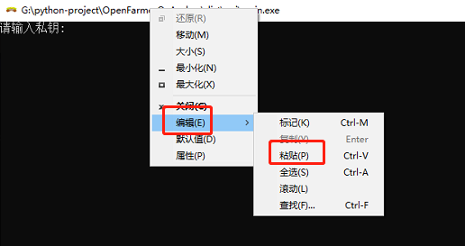

# Anchor钱包打包版main.exe安装教程

#### 方法一：

1、修改user.yml配置文件（推荐用nodepad++编辑器修改）

2、双击打开main.exe

3、输入私钥（可以试下复制后，在命令行的标题右键->编辑->粘贴）【回车】

:warning:控制台不显示是正常的，这样能保证私钥不暴露

4、输入密码（自定义的密码，用于加密私钥）【回车】

#### 方法二（cmder控制台软件）：

1、修改user.yml配置文件（推荐用nodepad++编辑器修改）

2、下载cmder控制台软件

3、打开cmder，执行main.exe

> 进入项目目录（假设项目放在D盘的OpenFarmer目录）
>
> 1、在命令行工具输入 D: ，如果在桌面或C盘就C:【按回车】
>
> 2、cd D:/OpenFarmer 【按回车】
>
> 3、执行main.exe【按回车】

4、输入私钥，ctrl+c复制私钥到控制台，ctrl+v。【回车】

:warning:控制台不显示是正常的，这样能保证私钥不暴露

5、输入密码（自定义的密码，用于加密私钥）【回车】


修改密码或换私钥，可以删除目录下的encrypttext文件，然后重新按上面步骤操作


